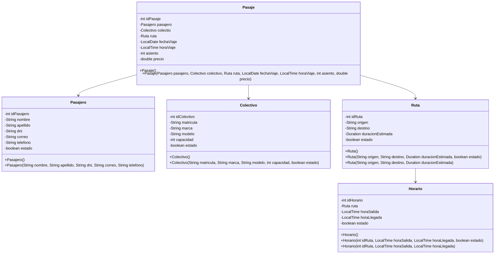

```mermaid
classDiagram
    class Pasajero {
        -int idPasajero
        -String nombre
        -String apellido
        -String dni
        -String correo
        -String telefono
        -boolean estado
        +Pasajero()
        +Pasajero(String nombre, String apellido, String dni, String correo, String telefono)
    }

    class Colectivo {
        -int idColectivo
        -String matricula
        -String marca
        -String modelo
        -int capacidad
        -boolean estado
        +Colectivo()
        +Colectivo(String matricula, String marca, String modelo, int capacidad, boolean estado)
    }

    class Ruta {
        -int idRuta
        -String origen
        -String destino
        -Duration duracionEstimada
        -boolean estado
        +Ruta()
        +Ruta(String origen, String destino, Duration duracionEstimada, boolean estado)
        +Ruta(String origen, String destino, Duration duracionEstimada)
    }
    class Horario {
        -int idHorario
        -Ruta ruta
        -LocalTime horaSalida
        -LocalTime horaLlegada
        -boolean estado
        +Horario()
        +Horario(int idRuta, LocalTime horaSalida, LocalTime horaLlegada, boolean estado)
        +Horario(int idRuta, LocalTime horaSalida, LocalTime horaLlegada)
    }

    class Pasaje {
        -int idPasaje
        -Pasajero pasajero
        -Colectivo colectio
        -Ruta ruta
        -LocalDate fechaViaje
        -LocalTime horaViaje
        -int asiento
        -double precio
        +Pasaje()
        +Pasaje(Pasajero pasajero, Colectivo colectivo, Ruta ruta, LocalDate fechaViaje, LocalTime horaViaje, int asiento, double precio)
    }
    Pasaje-->Pasajero
    Pasaje-->Colectivo
    Pasaje-->Ruta
    Ruta-->Horario
```
