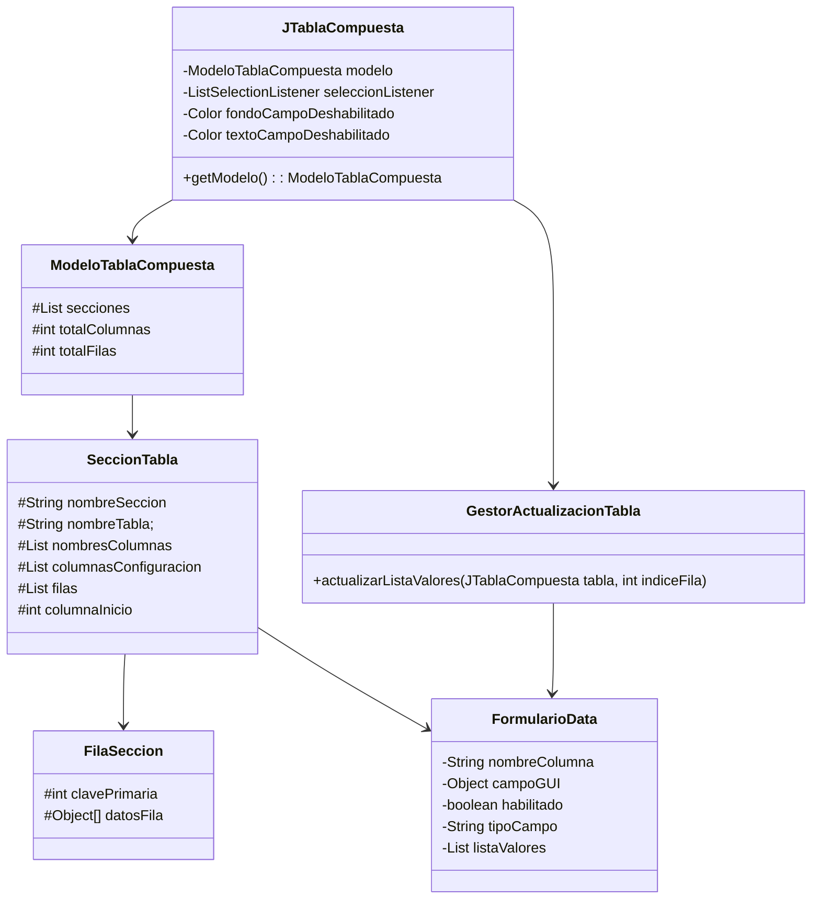

```mermaid
classDiagram
    class FilaSeccion {
        #int clavePrimaria
        #Object[] datosFila
    }

    class SeccionTabla {
        #String nombreSeccion
        #String nombreTabla;
        #List<String> nombresColumnas
        #List<FormularioData> columnasConfiguracion
        #List<FilaSeccion> filas
        #int columnaInicio
    }

    class FormularioData {
        -String nombreColumna
        -Object campoGUI
        -boolean habilitado
        -String tipoCampo
        -List<Object> listaValores
    }

    class ModeloTablaCompuesta {
        #List<SeccionTabla> secciones
        #int totalColumnas
        #int totalFilas
    }

    class JTablaCompuesta {
        -ModeloTablaCompuesta modelo
        -ListSelectionListener seleccionListener
        -Color fondoCampoDeshabilitado
        -Color textoCampoDeshabilitado
        +getModelo() : ModeloTablaCompuesta
    }

    class GestorActualizacionTabla {
        +actualizarListaValores(JTablaCompuesta tabla, int indiceFila)
    }

    SeccionTabla-->FilaSeccion
    SeccionTabla-->FormularioData
    ModeloTablaCompuesta-->SeccionTabla
    JTablaCompuesta-->ModeloTablaCompuesta
    JTablaCompuesta-->GestorActualizacionTabla
    GestorActualizacionTabla-->FormularioData
```
